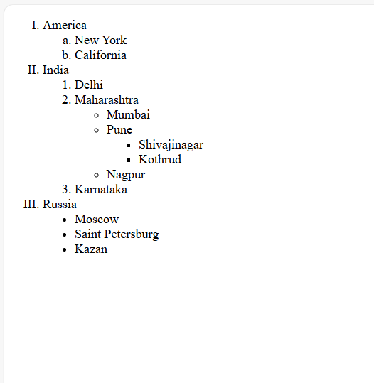
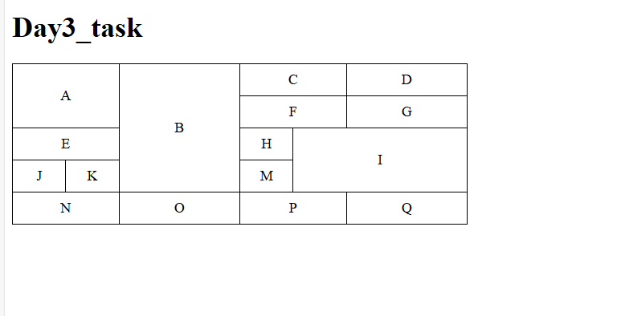

Day1: 
This HTML page is structured to help you understand the layout and usage of various tags commonly used in web development.
Below are the tag i used in this project

     Tag                              Description 

`<!DOCTYPE html>`            Declares the HTML5 document type 
 `<html>`                    Root element of the page 
 `<head>`                    Contains meta-information like charset and title 
 `<meta>`                    Defines metadata and responsiveness 
 `<title>`                   Sets the title of the page 
 `<body>`                    Contains all visible content 
 `<header>`                  Defines the top section (heading + nav) 
 `<nav>`                     Contains navigation links 
 `<a>`                       Used for linking to page sections 
 `<section>`                 Organizes content into logical blocks 
 `<h1>`, `<h2>`              Headings for title and subsections 
 ``                     Embeds an image 
 `<ul>`, `<ol>`, `<li>`      Unordered/Ordered lists with list items 
 `<audio>` / `<video>`       Embeds audio and video players 
 `<source>`                  Provides file sources for media 
`<hr>`                       Horizontal line for separation 
 `<footer>`                  Footer content (credits/info) 


 # Day 2: Nested List HTML Task

This HTML page demonstrates the structure and styling of **nested ordered and unordered lists** using various list types in HTML. It helps understand how different `list-style-type` values and nesting levels work together to create structured lists.

## 📄 File Name:
`day2_task.html`

##  Description:

This page contains a nested list structure including:

- Roman numeral ordered lists (`type="I"`)
- Alphabetic ordered lists (`type="a"`)
- Numeric ordered lists (`type="1"`)
- Unordered lists with `circle` and `disc` styles

The list demonstrates deep nesting, combining both `<ol>` (ordered list) and `<ul>` (unordered list) elements to represent hierarchical data.

## Tags & Attributes Used:

| Tag / Attribute              | Description                                                 |
|-----------------------------|-------------------------------------------------------------|
| `<!DOCTYPE html>`           | Declares the HTML5 document type                            |
| `<html lang="en">`          | Sets the language to English                                |
| `<meta charset="UTF-8">`    | Sets character encoding to UTF-8                            |
| `<meta name="viewport">`    | Ensures responsiveness on different devices                 |
| `<title>`                   | Sets the page title shown on browser tab                    |
| `<ol>`                      | Ordered List (supports types: `1`, `a`, `A`, `i`, `I`)       |
| `<ul>`                      | Unordered List (supports styles: `disc`, `circle`, `square`) |
| `<li>`                      | List item in both ordered and unordered lists               |
| `style="list-style-type:"`  | Inline style to change bullet type in unordered lists       |

---

## Output Screenshot



# Day 3_Task - HTML Table Task

This project demonstrates the use of HTML table tags such as `rowspan`, `colspan`, and layout control using CSS to create a complex table structure letter.

## Features

- Complex HTML table with merged cells using `rowspan` and `colspan`
- CSS styling with `border-collapse`, `table-layout`, and column widths
- Semantic HTML using `<thead>` and `<tbody>`
- Fixed-width layout using `table-layout: fixed`

##  HTML Tags Used

| Tag        | Purpose                                          |
|------------|--------------------------------------------------|
| `<table>`  | Defines the table structure                      |
| `<tr>`     | Table row                                        |
| `<td>`     | Table data cell                                  |
| `<th>`     | Table header cell                                |
| `colspan`  | Merges cells horizontally across columns         |
| `rowspan`  | Merges cells vertically across rows              |
| `<thead>`  | Table header section                             |
| `<tbody>`  | Table body section                               |

## Output Screenshot




## CSS Styling

```css
table {
    border-collapse: collapse;
    width: 28%;
    table-layout: fixed;
}

table, th, td {
    border: 1px solid black;
    text-align: center;
    padding: 8px;
}


# Day 4_Task - HTML Table Task
 Book Your Car Service – HTML Form
A clean and responsive HTML form for booking car service appointments.

Features
Customer Info: Name, Email, Phone, City (with suggestions)

Vehicle Details: Reg. Number, Model, Make, Color, Year

Service Options: Checkboxes for services, pickup option, preferred time

Feedback: Rating slider and special instructions

Upload: RC document (file input)

Form Controls: Submit & Reset buttons

Tech Used
HTML5

Internal CSS

Flexbox for layout

Modern input types (email, date, color, range, etc.)

## Output Screenshot


#  **Day-5 Task: Car Service Booking Form (HTML + CSS + JS)**

This **Day-5** project focuses on building a fully functional and visually styled **Car Service Booking Form** using HTML, CSS, and basic JavaScript. It demonstrates form structure, layout using Flexbox, input variety, and DOM manipulation for a real-world use case.

---

##  Features

-  Responsive layout using Flexbox
-  Clean UI with shadows, padding, and rounded corners
-  Semantic HTML: fieldsets and legends used for structure
-  Rich input elements:
  - Text, Email, Phone, Number
  - Color picker, Range slider with live value
  - DateTime picker
  - Checkbox and Radio buttons
  - File upload input
  - Datalist for auto-suggest city input
-  JavaScript:
  - Submit button: Prevents form default behavior & shows alert
  - Reset button: Custom reset alert

---

## 📷 Screenshot

> Replace below with your actual output screenshot


---

## 🧠 Concepts Covered

| HTML/CSS Concept   | Description                                                  |
|--------------------|--------------------------------------------------------------|
| `<form>`           | Form wrapper element                                          |
| `fieldset` & `legend` | Semantic grouping of related inputs                     |
| `input` types      | `text`, `email`, `tel`, `file`, `range`, `datetime-local`    |
| `textarea`         | Multi-line input                                              |
| Flexbox            | Responsive row and column alignment                           |
| JavaScript         | `addEventListener`, `preventDefault()`, DOM manipulation      |

---


# Day Weekend: 
🛍️ Creative Product Order Form
A modern and visually engaging product order form built using HTML and CSS, designed to capture detailed product orders including quantities, sizes, colors, billing information, gift messages, and payment methods. Ideal for learning or demonstrating form-building and layout techniques.

✨ Features
Product selection with dynamic options for quantity, color, and size

Bulk order table for quick product entry

User contact and billing address input

Optional gift message input

Product preview audio

Embedded demo video (YouTube)

Payment method selection (Card, PayPal)

Tech Stack
HTML5
CSS3

##  Key HTML & CSS Concepts Used

| **Tag / Property**            | **Type**     | **Purpose / Role in Form**                                                |
|------------------------------|--------------|---------------------------------------------------------------------------|
| `<form>`                     | HTML Element | Wraps all form controls and handles submission.                          |
| `input`, `select`, `textarea`| HTML Elements| Collect user data like text, options, and long messages.                |
| `type="email"`, `type="tel"` | Attribute     | Validates specific input formats (email, phone).                         |
| `placeholder`                | Attribute     | Displays example text in form fields.                                   |
| `label for + input id`       | HTML Pattern  | Associates labels with inputs for accessibility.                         |
| `<table>`                    | HTML Element  | Organizes bulk product orders in rows/columns.                          |
| `<audio>`, `<iframe>`        | HTML Element  | Adds multimedia preview (audio & video).                                |
| `name` attribute             | Attribute     | Assigns identifiers for backend data processing.                         |
| `required`, `min`, `max`     | Form Attribute| Used for input validation and constraints.                              |
| `box-sizing: border-box;`    | CSS Property  | Prevents box overflow by including padding and borders inside width.    |
| `display: flex;`             | CSS Layout    | Aligns elements in row/column layouts (used in product and form layout).|
| `gap`, `flex-wrap`           | CSS Flexbox   | Adds spacing between items and handles responsive wrapping.             |
| `width`, `padding`, `margin`| CSS Properties| Used for spacing, layout, and responsiveness.                            |
| `border: none`               | CSS Styling   | Removes default input borders for clean design.                          |


#  Day 8 - Web Dev Journey

##  What I Learned Today

### ✅ Git & GitHub
Today, I explored **Git and GitHub basics** through YouTube tutorials. I learned:
- Creating repositories
- Cloning repos to local system
- Committing and pushing changes
- Managing version control through Git
- Publishing and updating projects on GitHub

### ✅ JavaScript Basics
Studied `let`, `var`, and `const` from **W3Schools**:

| Keyword   | Scope        | Reassignable | Hoisting | Notes                                      |
|-----------|--------------|--------------|----------|--------------------------------------------|
| `var`     | Function     | ✅ Yes        | ✅ Yes    | Function-scoped, can be redeclared         |
| `let`     | Block        | ✅ Yes        | ❌ No     | Preferred for mutable values (block-level) |
| `const`   | Block        | ❌ No         | ❌ No     | Used for constants (cannot be reassigned)  |

> [JavaScript let, const, var - W3Schools](https://www.w3schools.com/js/js_let.asp)

##  Project Work

### 🧾 Project Name: Creative Product Order Form

I continued building the **Product Order Form** project I started during the weekend. Today, I added a **`<table>` section** for handling **bulk product orders** within the form.


#  Web Dev Journey – Day 9

## ✅ Topics I Learned Today

### 🔹 1. How JavaScript Code Runs Behind the Scenes
- Global Execution Context and Functional Execution Context
- Memory Allocation (Creation Phase) vs Code Execution (Execution Phase)
- Call Stack and how JavaScript is single-threaded and synchronous by default
### 🔹 2. Hoisting in JavaScript
- Variables declared with `var` are hoisted and initialized with `undefined`
- Variables declared with `let` and `const` are hoisted but not initialized (Temporal Dead Zone)
- Accessing `let` or `const` before declaration throws a `ReferenceError`

console.log(a); // undefined
var a = 10;

console.log(b); // ReferenceError
let b = 20;

3. Shadowing in JavaScript
Shadowing occurs when a variable in an inner scope has the same name as one in an outer scope

let and const create block-scoped variables, while var is function-scoped

let x = 1;
{
  let x = 2; // shadows the outer 'x'
  console.log(x); // 2
}
console.log(x); // 1

📺 Resource I Used
I followed Akash Sani's JavaScript tutorials on YouTube:
🔗 Click to Watch

# JavaScript Learning Log – Day 10
i studied String 


# JavaScript Learning Log – Day 11-12 ans weekend 

I worked on html-css-task , using this i worked on project


#  Web Dev Journey– Day 15

JavaScript Arrays – What I Learned
✅ 1. Creating Arrays
Using square brackets:
const fruits = ["Apple", "Banana", "Mango"];
Using new Array():
const numbers = new Array(1, 2, 3, 4);
📦 2. Accessing & Modifying Elements
Access by index (0-based):
console.log(fruits[0]); // "Apple"
Change value:
fruits[1] = "Orange";
➕ 3. Array Methods
Add/Remove at end:
fruits.push("Grapes");   // Add
fruits.pop();            // Remove
Add/Remove at start:
fruits.unshift("Kiwi");  // Add
fruits.shift();          // Remove
🔁 4. Iterating Over Arrays
Using for loop:
for (let i = 0; i < fruits.length; i++) {
  console.log(fruits[i]);
}
Using forEach:
fruits.forEach(function(item) {
  console.log(item);
});
🔍 5. Searching & Filtering
includes():
fruits.includes("Apple"); // true
indexOf():
fruits.indexOf("Banana"); // -1 (if not found)
filter():
const bigNums = numbers.filter(num => num > 10);

🧠 6. Other Useful Methods
concat() – combine arrays

slice() – extract a portion

splice() – remove/replace elements

join() – convert to string

reverse() – reverse array

sort() – sort elements (be careful with numbers)

🧪 7. Array Type Checks
Array.isArray(fruits); // true
typeof fruits;         // "object"

🔄 8. Map, Reduce, Find
map() – transform each item:
const doubled = numbers.map(num => num * 2);
reduce() – accumulate values:
const sum = numbers.reduce((acc, curr) => acc + curr, 0);
find() – first match:
const found = numbers.find(num => num > 10);

🧊 9. Immutable vs Mutable
Most array methods mutate the array (push, pop, splice)
Some methods return a new array (map, filter, slice)

## 📚 Link
check out [Visit W3Schools](https://www.w3schools.com).


#  Web Dev Journey – Day 16

1. Object Creation
Using literals:
const obj = { firstName: "Ankit", age: 23 };

Using new Object():
const person = new Object();
person.firstName = "Ank";

🛠️ 2. Accessing & Modifying Properties
Dot notation & Bracket notation:
console.log(person.firstName); // or person["firstName"]
Add property: person.nationality = "Indian";

Delete property: delete person.age;

Accessing missing properties returns undefined

🔁 3. Looping & Conversion
For-in loop:
for (let key in person) {
  console.log(person[key]);
}
Object utility methods:

Object.keys(obj) → array of property names

Object.values(obj) → array of values

Object.entries(obj) → array of key-value pairs

Object.fromEntries() → convert array to object

JSON.stringify(obj) → object to JSON string

🧠 4. Methods Inside Objects
Objects can contain functions (methods):
const person = {
  fullName: function() { return this.first + " " + this.last; }
};
👪 5. Constructor Functions & Prototypes
Function as constructor:
function Person(f, l, a) {
  this.first = f;
  this.last = l;
  this.age = a;
}
Add shared property using prototype:
Person.prototype.nationality = "Indian";
Add method to all instances:
Person.prototype.changeName = function(name) {
  this.lastName = name;
};
⚠️ 6. Important Exceptions
You cannot directly add methods to constructor like Person.changeName = ... for all instances — use prototype instead.

Math is a global object — not constructible with new.

🧊 7. Object Immutability
Prevent changes:

Object.preventExtensions(obj) – can't add new props

Object.seal(obj) – can't add/remove, only modify

Object.freeze(obj) – fully read-only

🧪 8. Miscellaneous
Object.assign(target, source) – merges two objects

Object.getOwnPropertyNames(obj) – returns all properties (including non-enumerable)

Nested objects are accessed like obj.child.key

## 📚 Link

check out [Visit W3Schools](https://www.w3schools.com).


#  Web Dev Journey– Day 17

/* various cases i tried in for loop   */

| Case                           | Code Example                                         | Behavior         | Notes                                  |
| ------------------------------ | ---------------------------------------------------- | ---------------- | -------------------------------------- |
| 1️⃣ All parts present          | `for (let i = 0; i < 5; i++)`                        | ✅ Normal loop    | Most common                            |
| 2️⃣ No Initialization          | <pre>let i = 0;<br>for (; i < 5; i++)                | ✅ Works          | `i` must be declared earlier           |
| 3️⃣ No Condition               | `for (let i = 0;; i++)`                              | 🔁 Infinite loop | Runs forever unless `break` is used    |
| 4️⃣ No Increment               |  for (let i = 0; i < 5; ) {<br>  i++;<br>}          | ✅ Works          | You control `i++` manually inside loop |
| 5️⃣ Only condition & increment | let i = 0;<br>for (; i < 5; i++)                     | ✅ Works          | Initialization done outside            |
| 6️⃣ Only increment             | let i = 0;<br>for (;; i++)                           | 🔁 Infinite loop | No condition → always true             |
| 7️⃣ All omitted                | `for (;;)`                                           | 🔁 Infinite loop | Like a `while(true)` loop              |

➤ for loop basics
for (let i = 0; i < n; i++) {
  console.log(i);
  i = i + 1;
}
Practiced how incrementing i manually affects loop execution.

Realized that this can skip values unintentionally.

➤ Two good examples – var vs let
var i = 5;
for (var i = 0; i < 10; i++) {
  console.log(i);  // prints 0 to 9
}
console.log(i);      // prints 10 (var is function-scoped)

let i = 5;
for (let i = 0; i < 10; i++) {
  console.log(i);  // prints 0 to 9
}
console.log(i);      // prints 5 (because let is block-scoped)
This helped me understand scope difference between var and let.

➤ Reference error when using undeclared variable 
for (; i < 5; i++) {
  console.log(i);
}
// Got a ReferenceError if `i` is not defined before the loop
➤ while loop
let i = 0;
while (i < 10) {
  console.log(i);
  i++;
}
Straightforward — keeps running till the condition is true.

➤ do...while loop
let i = 0;
do {
  console.log(i);
  i++;
} while (i < 10);
Even if condition is false, runs once — good to know for specific cases.

🔂 Looping Over Arrays & Objects
➤ for...of (best array , if we used on object it will give syntax error)
let arr = ["Ank", "Tiw", "How", "are", "you"];
for (let word of arr) {
  console.log(word);
}
Best for values in an array.

➤ for...in (used on objects)
const person = { fname: "John", lname: "Doe", age: 25 };
for (let key in person) {
  console.log(person[key]);
}
Loops through keys in an object.

➤ forEach()
let arr = ["Ank", "Tiw", "How", "are", "you"];
arr.forEach((item, index, array) => {
  console.log(item);
});
Tried using it for logic — realized it doesn’t return anything.
Example:
const result = [1, 2, 3].forEach(num => num * 2);
console.log(result); // undefined
Also learned: it skips empty items:
let arr = [1, , 3];
arr.forEach((val, i) => {
  console.log(i, val);  // Only 0 and 2 printed
});

🔄 Loop Control: break & continue
➤ break // it terminate the loop as condition of break true 
for (let i = 0; i < 10; i++) {
  if (i === 5) break;
  console.log(i); // stops when i is 5
}
➤ continue // it skip only one step
for (let i = 0; i < 10; i++) {
  if (i === 5) continue;
  console.log(i); // skips printing 5
}
🧊 JavaScript Object Protection
Studied three important methods:

1. Object.freeze(obj)
Prevents any changes — no adding, deleting, or editing properties.

2. Object.seal(obj)
Can't add/delete properties, but can change existing values.

3. Object.preventExtensions(obj)
Blocks adding new properties, but allows deleting or modifying existing ones.
Tried small examples on each. Got more clarity on how to make objects read-only or semi-editable.

📚 Link
🔗 https://www.w3schools.com/js/js_loop_for.asp – Loops in JS

🔗 https://www.w3schools.com/js/js_objects.asp – JavaScript Objects


#  Web Dev Journey– Day 18


## 🧠 JavaScript Function Concepts

### 1. Parameters vs Arguments
- **Parameters**: Defined in function declaration.
- **Arguments**: Actual values passed when function is called.

 2. Missing Arguments Are `undefined`
function greet(x, y) {
  console.log(x, y);
}
greet(10); // 10 undefined
 3. Default Parameters
function greet(name = "Guest") {
  console.log("Hello " + name);
}
greet(); // Hello Guest
4. Rest Parameters
function sum(...args) {
  return args.reduce((acc, curr) => acc + curr, 0);
}
sum(1, 2, 3); // 6
5. arguments Object
Available in regular functions (not arrow).

Useful for accessing all passed arguments.
function findMax() {
  let max = -Infinity;
  for (let i = 0; i < arguments.length; i++) {
    if (arguments[i] > max) max = arguments[i];
  }
  return max;
}
Pass by Value vs Reference
 6. Primitives Are Passed by Value
function modify(x) {
  x += 10;
}
let a = 5;
modify(a);
console.log(a); // 5
 7. Objects Are Passed by Reference
function modify(obj) {
  obj.name = "Ankit";
}
const user = { name: "John" };
modify(user);
console.log(user.name); // Ankit

Function Invocation
8. Regular Function Call
function multiply(a, b) {
  return a * b;
}
multiply(2, 3); // 6
 9. this Keyword
Depends on how the function is called

Refers to the object invoking the function
const person = {
  name: "Ankit",
  greet() {
    console.log("Hello " + this.name);
  }
};
person.greet(); // Hello Ankit

🧩 call, apply, bind
✅ 10. call() – Function Borrowing
function greet() {
  console.log("Hello " + this.name);
}
const user1 = { name: "Ankit" };
const user2 = { name: "Rahul" };
greet.call(user1); // Hello Ankit
greet.call(user2); // Hello Rahul

✅ 11. apply() – Like call(), but accepts array arguments
function intro(city, country) {
  console.log(`${this.name} from ${city}, ${country}`);
}
const person = { name: "Ankit" };
intro.apply(person, ["Delhi", "India"]); // Ankit from Delhi, India

✅ 12. bind() – Returns a new function with this fixed
function sayHi() {
  console.log("Hi " + this.name);
}
const person = { name: "Ankit" };
const sayHiToAnkit = sayHi.bind(person);
sayHiToAnkit(); // Hi Ankit

⚙️ Generator Functions
✅ 13. Generator Basics
js
Copy
Edit
function* generateNums() {
  yield 1;
  yield 2;
  yield 3;
}
const gen = generateNums();
console.log(gen.next()); // { value: 1, done: false }


