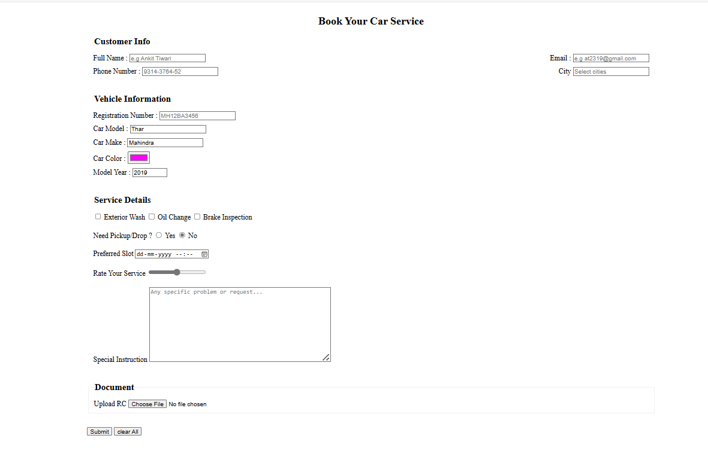

Day1: 
This HTML page is structured to help you understand the layout and usage of various tags commonly used in web development.
Below are the tag i used in this project

     Tag                              Description 

`<!DOCTYPE html>`            Declares the HTML5 document type 
 `<html>`                    Root element of the page 
 `<head>`                    Contains meta-information like charset and title 
 `<meta>`                    Defines metadata and responsiveness 
 `<title>`                   Sets the title of the page 
 `<body>`                    Contains all visible content 
 `<header>`                  Defines the top section (heading + nav) 
 `<nav>`                     Contains navigation links 
 `<a>`                       Used for linking to page sections 
 `<section>`                 Organizes content into logical blocks 
 `<h1>`, `<h2>`              Headings for title and subsections 
 ``                     Embeds an image 
 `<ul>`, `<ol>`, `<li>`      Unordered/Ordered lists with list items 
 `<audio>` / `<video>`       Embeds audio and video players 
 `<source>`                  Provides file sources for media 
`<hr>`                       Horizontal line for separation 
 `<footer>`                  Footer content (credits/info) 

 # Day 2: Nested List HTML Task

This HTML page demonstrates the structure and styling of **nested ordered and unordered lists** using various list types in HTML. It helps understand how different `list-style-type` values and nesting levels work together to create structured lists.

## 📄 File Name:
`day2_task.html`

##  Description:

This page contains a nested list structure including:

- Roman numeral ordered lists (`type="I"`)
- Alphabetic ordered lists (`type="a"`)
- Numeric ordered lists (`type="1"`)
- Unordered lists with `circle` and `disc` styles

The list demonstrates deep nesting, combining both `<ol>` (ordered list) and `<ul>` (unordered list) elements to represent hierarchical data.

## Tags & Attributes Used:

| Tag / Attribute              | Description                                                 |
|-----------------------------|-------------------------------------------------------------|
| `<!DOCTYPE html>`           | Declares the HTML5 document type                            |
| `<html lang="en">`          | Sets the language to English                                |
| `<meta charset="UTF-8">`    | Sets character encoding to UTF-8                            |
| `<meta name="viewport">`    | Ensures responsiveness on different devices                 |
| `<title>`                   | Sets the page title shown on browser tab                    |
| `<ol>`                      | Ordered List (supports types: `1`, `a`, `A`, `i`, `I`)       |
| `<ul>`                      | Unordered List (supports styles: `disc`, `circle`, `square`) |
| `<li>`                      | List item in both ordered and unordered lists               |
| `style="list-style-type:"`  | Inline style to change bullet type in unordered lists       |

---

## Output Screenshot


# Day 3_Task - HTML Table Task

This project demonstrates the use of HTML table tags such as `rowspan`, `colspan`, and layout control using CSS to create a complex table structure letter.

## Features

- Complex HTML table with merged cells using `rowspan` and `colspan`
- CSS styling with `border-collapse`, `table-layout`, and column widths
- Semantic HTML using `<thead>` and `<tbody>`
- Fixed-width layout using `table-layout: fixed`

##  HTML Tags Used

| Tag        | Purpose                                          |
|------------|--------------------------------------------------|
| `<table>`  | Defines the table structure                      |
| `<tr>`     | Table row                                        |
| `<td>`     | Table data cell                                  |
| `<th>`     | Table header cell                                |
| `colspan`  | Merges cells horizontally across columns         |
| `rowspan`  | Merges cells vertically across rows              |
| `<thead>`  | Table header section                             |
| `<tbody>`  | Table body section                               |

## Output Screenshot


## CSS Styling

```css
table {
    border-collapse: collapse;
    width: 28%;
    table-layout: fixed;
}

table, th, td {
    border: 1px solid black;
    text-align: center;
    padding: 8px;
}


# Day 4_Task - HTML Table Task
 Book Your Car Service – HTML Form
A clean and responsive HTML form for booking car service appointments.

Features
Customer Info: Name, Email, Phone, City (with suggestions)

Vehicle Details: Reg. Number, Model, Make, Color, Year

Service Options: Checkboxes for services, pickup option, preferred time

Feedback: Rating slider and special instructions

Upload: RC document (file input)

Form Controls: Submit & Reset buttons

Tech Used
HTML5

Internal CSS

Flexbox for layout

Modern input types (email, date, color, range, etc.)

## Output Screenshot



# 🧾 Day 5 Task – Car Service Booking Form(I worked in this form on day4 i improved much more on day5 )

This project is a responsive, styled car service booking form created using **HTML**, **CSS**, and a bit of **JavaScript**. It includes a variety of input types, fieldsets for grouping, and user-friendly form design.

---

## ✨ Features

- 📇 Collects **Customer Information**: name, email, phone, city (with datalist)
- 🚗 Gathers **Vehicle Details**: registration, model, make, color, year
- 🔧 Allows selecting **Services** and pickup/drop options
- 🗓️ Chooses preferred **date & time slot**
- 📊 Includes a **rating slider** with dynamic display
- 📝 Accepts **special instructions** via textarea
- 📎 Uploads **RC document**
- 🚨 JS alerts on **form submit** and **reset**
- 💾 Download the form file as `day4_task.html`

---

## 🔠 HTML Tags & Input Types Used

| Element/Attribute     | Purpose                                          |
|------------------------|--------------------------------------------------|
| `<form>`              | Main container for the form                     |
| `<fieldset>`          | Groups related inputs visually                  |
| `<legend>`            | Describes each field group                      |
| `<input type="text">` | Name, registration, city, model, make           |
| `<input type="email">`| For email address                               |
| `<input type="tel">`  | For phone number                                |
| `<input type="color">`| Car color picker                                |
| `<input type="number">`| For model year with min-max validation         |
| `<input type="checkbox">`| For multi-service selection                |
| `<input type="radio">`| Pickup/Drop option                              |
| `<input type="datetime-local">`| Slot selection                      |
| `<input type="range">`| Rating slider                                   |
| `<input type="file">` | Upload RC file                                  |
| `<textarea>`          | For special instructions                        |
| `<datalist>`          | Provides city suggestions in text input         |

---

## 🎨 CSS Styling Highlights

| Property               | Description                                      |
|------------------------|--------------------------------------------------|
| `width: 60%`           | Limits form width for better layout             |
| `box-shadow`           | Adds depth to form container                    |
| `display: flex`        | Aligns input rows side-by-side                  |
| `flex: 1 1 45%`        | Distributes form groups evenly with wrapping    |
| `resize: vertical`     | Allows only vertical resizing of textarea       |
| `border-radius`        | Smooth corners for inputs and buttons           |
| `position: relative`   | Used to align range slider labels (0 and 10)    |

---

## 🧪 JavaScript Interaction

| Feature               | Description                                      |
|------------------------|--------------------------------------------------|
| `Submit Button`        | Prevents default behavior and shows alert       |
| `Reset Button`         | Prevents reset and displays custom message      |
| `oninput` on `<input type="range">` | Updates rating dynamically        |

---

## 📷 Output Screenshot

> You can save and place a screenshot in a folder like `/output/Day5.png`.

```markdown


